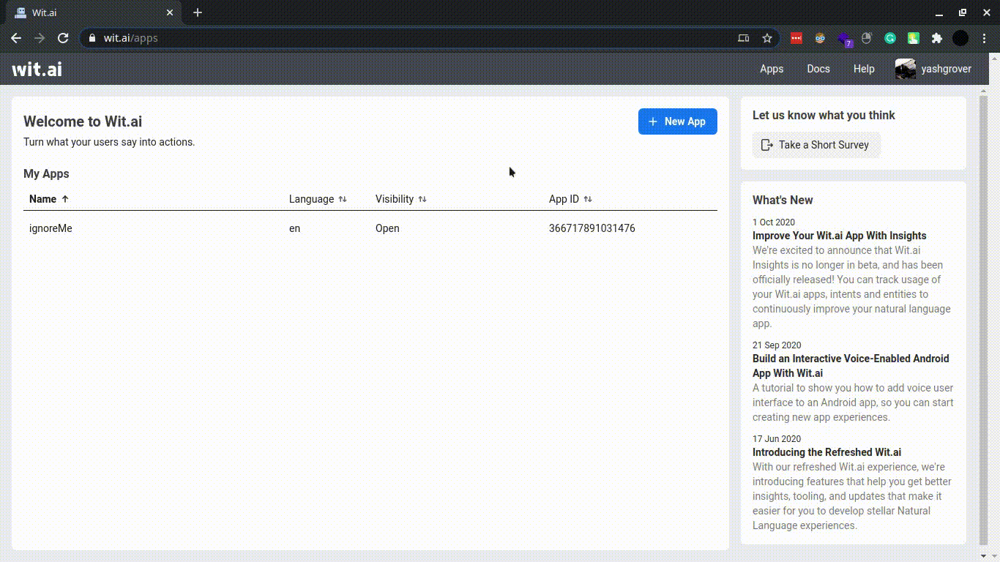
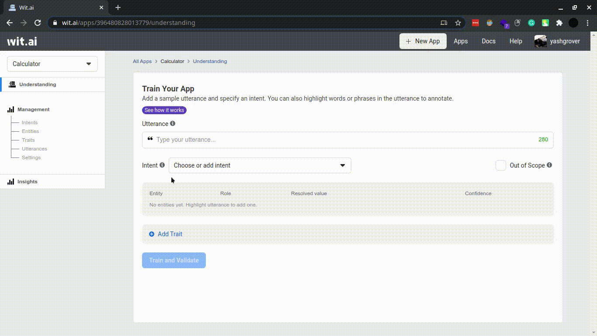
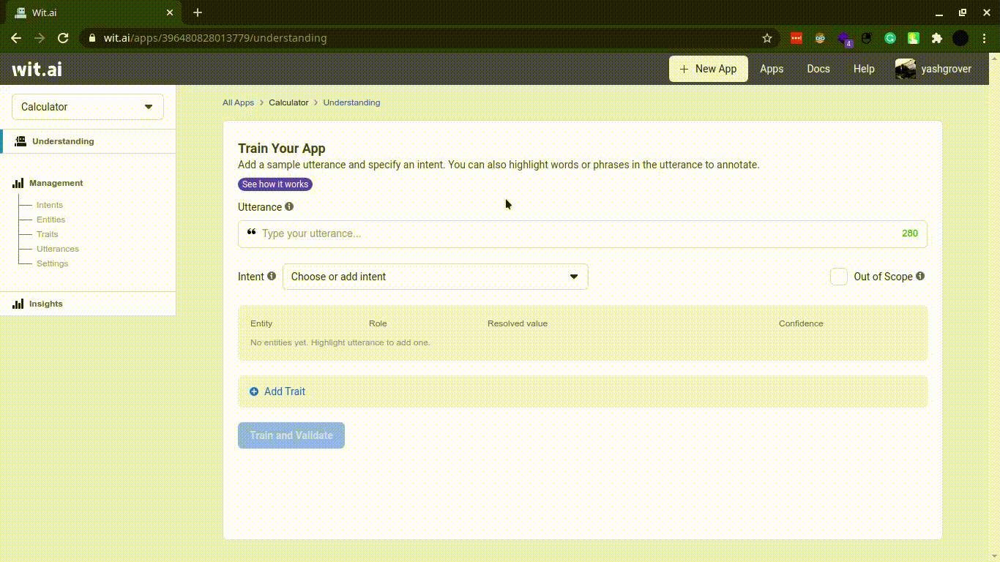
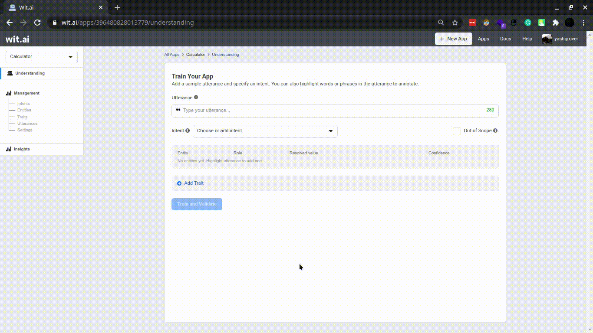
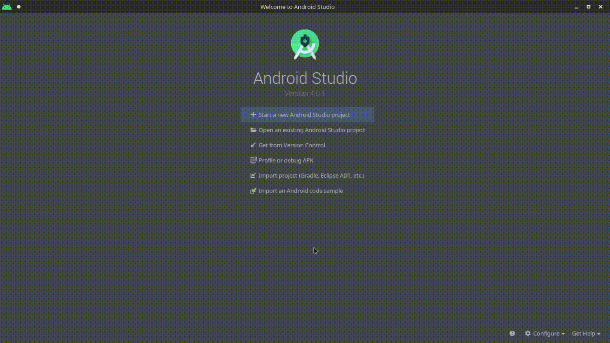
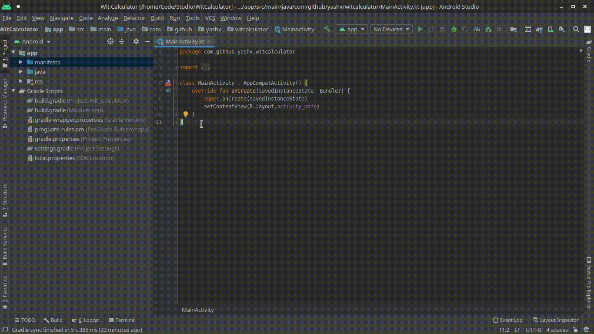

# Making Conversational Android Apps with Wit.ai

In this article, I will explain the basics of Wit.ai while walking you through the steps needed to set up a Wit.ai app and also show you how to integrate it with an Android App.

As building a project is one of the best ways to learn something new, we will make a simple conversational calculator which works with both text and audio inputs.
(Click the image below to see the finished app)

[](http://www.youtube.com/watch?v=pHQbD0q7Aqg)

Let's Start.

## Prerequisites
While I have tried to make the steps as descriptive as possible, you need to know a little bit about building an Android App and using Retrofit. 

If you are new to Android development, don't worry you should be able to follow along. Just copy and paste the code snippets that I have shared and try to understand bit by bit. (I have also linked to source code of the finished project at the end of this article)

If you don't know Android development, you still read the first half of this article to know about **Wit.ai** and use any of the available client libraries ([Node.js](https://github.com/wit-ai/node-wit), [Python](https://github.com/wit-ai/pywit), [Ruby](https://github.com/wit-ai/wit-ruby), [Go](https://github.com/wit-ai/wit-go)) to make a client instead of making an Android App.

## Making the Wit.ai App
### What is Wit.ai?
**[Wit.ai](https://wit.ai/)** is a Natural language processing (NLP) Engine that can extract structured data from complex voice or text messages.

This allows us to build apps that can understand what the user is saying and take appropriate action.

### Create a new Wit.ai App
We will start by first creating a Wit.ai App. To do this
1. Go to **[Wit.ai](https://wit.ai/)** and log in with your Facebook ID
2. Click on **New App** Button
3. Give your Application a name 
4. Click on **Create** Button



### Add Intents
#### What is an Intent?
**Intent** represents the intention of the message. It is the action that the user wants to perform.

Wit.ai will parse the message we give to it and deliver us the intent.

**Consider this example**
Say today is 4 October 2020 (Sunday) and you want to ask tomorrow's weather.

There are multiple ways you express this
- What's the weather tomorrow?
- What's the weather like on Monday?
- What's the weather on 5 October?

But the intent remains the same. 

#### How to add Intents?
As we are building a calculator, there are 4 intents (or actions) we will support.
1. **add_num** : To add 2 numbers
2. **sub_num** : To subtract 2 numbers
3. **mul_num** : To multiply 2 numbers
4. **div_num** : To divide 2 numbers

Follow these steps for all Intents to add them to your Wit.ai Application
1. Click on **Intents** under **Management** in the sidebar.
2. Click on "**+ Intent**" Button 
3. Give the Intent a name
4. Click **Next** button



### Add Entites
#### What is an Entity?
**Entity** represents the data provided in the message. It is the data the user wants the action to be performed on.

**Consider this example**
In the message "What is 47℉ in Celsius?", the **intent** is **"convert to celsius"** and the **47℉** is a **temperature entity** which we need to convert.

#### Built-in Entities and Custom Entities
To make development easier, Wit.ai provides many **[built-in entities](https://wit.ai/docs/built-in-entities)** that cover most use cases. But in case there is no built-in entity that we can use, we can also create **[custom entities](https://wit.ai/docs/recipes#extract-a-keyword-entity)**.

Remember whenever it's possible, use the **built-in entities** over your own **custom entities** to get better results.

#### How to add Entities?
For our calculator, we can use **[wit/number](https://wit.ai/docs/built-in-entities/#wit_number)** 

Follow these steps to add an entity
1. Click on **Entities** under **Management** in the sidebar.
2. Click on "**+ Entity**" Button 
3. Select **"Add built-in entity"**
4. Select the entities you want (**wit/number** in this case)
5. Click **Next** button


### Entity Roles
#### What is an Entity Role?
Entity Roles help us differentiate multiple entities of the same type in a message.

**Consider this example**
In the message "Find me a ticket from India to Canada", the **intent** is **"find a ticket"** and the **India** and **Canada** are **location entities**.
But we can't tell which is the origin and which is the destination.

Entity roles are made to solve this problem.
#### Adding Roles to an Entity
For our calculator, when subtracting and dividing numbers the role of a number is important. (as **3-2 ≠ 2-3** and **3/2 ≠ 2/3**)

To keep it simple, we will create two roles for numbers **first** and **second**, and do **first - second** when subtracting and **first / second** when dividing.

Follow these steps for both roles to add them to **wit/number** entity 
1. Click on **Entities** under **Management** in the sidebar
2. Click on an **entity** to add a role to. (Here **wit/number**)
3. Click **Add a new role** button
4. Give the role a name
5. Click on **Save** button
6. Delete default roles



### Train your Wit.ai Application
Now we need to train Wit.ai to understand our messages by giving it **sample messages** and labelling in them the **intent** and **entities** we create earlier.

Follow these steps to label and train a sample message
1. Click on **Understanding** in the sidebar.
2. Give a sample message in **Utterance** field
3. Make sure the **correct intent is selected**. If not, select the correct one.
4. Make sure the **entities are selected**. If not, highlight the entity that should be selected and select the correct option from the dropdown that is shown.
5. Make sure the correct role is selected for an entity. If not, select the correct one.
5. Click on **Train and Validate** button.



We only need to give a few examples for each intent but the more you give the better Wit.ai will understand your messages and extract the correct data from them.

Btw, you can also see the messages you have trained by clicking on **Utterances** under **Management** in the sidebar

### That's It
We have now made our Wit.ai application and can start working on our Android App but before we do so. We need a Client Access Token so that our Android App can talk to our Wit.ai App.

Follow these steps to get a **Client Access Token** for your app
1. Click on **Settings** under **Management** in the sidebar
2. Generate a new **Client Access Token** or you can use an existing token if it is present
3. Copy your Token

Store this token somewhere we will need it later

## Making the Android App

### Create a new Android Project
Alright, Let's start making our Android App. We will first make a new project. Follow these steps
1. Open **[Android Studio](https://developer.android.com/studio)**
2. Click on **Start a new Android Studio Project**
3. Choose **Empty Activity** as a Template
4. Click **Next** button
5. Give your app a Name (I will call it Wit Calculator)
6. Choose **Kotlin** as the Language
7. Choose **API 21** as the minimum SDK 
8. Click **Finish** Button



### Add Dependencies 
Unfortunately, there is no official Android SDK for Wit.ai but they do have a **[HTTP API](https://wit.ai/docs/http/)** which we can access with **[Retrofit](https://square.github.io/retrofit/)**.

To use Retrofit in our app we need to add the following dependencies to our **app-level build.gradle** file. 
```Gradle
// use the latest version
implementation "com.squareup.retrofit2:retrofit:2.9.0"
```
Remember to click on **Sync Now** button after you make changes to your gradle file.


### Target Java 8
**Retrofit** uses **OkHttp** to make Http Requests which requires us to [target Java 8](https://square.github.io/okhttp/upgrading_to_okhttp_4/#gradle).
So to make sure everything works properly, just add the following lines to the **app-level build.gradle** file (same file as above).

```Gradle
android {
    // truncated

    // add this
    compileOptions {
        sourceCompatibility JavaVersion.VERSION_1_8
        targetCompatibility JavaVersion.VERSION_1_8
    }
    
    // and also this
    kotlinOptions {
        jvmTarget = "1.8"
    }
}

dependencies {
    // truncated
}
``` 

### Add Permissions to Manifest
Our app needs the following permissions so add them to your **AndroidManifest.xml** 
```XML
    <uses-permission android:name="android.permission.INTERNET" />
    <uses-permission android:name="android.permission.RECORD_AUDIO"/>
```
**android.permission.INTERNET** is needed to talk to our Wit.ai App. 
**android.permission.RECORD_AUDIO** is needed to record voice messages which we will send to our Wit.ai App



### Request Permissions at Runtime
While **android.permission.INTERNET** is a normal permission, 
**android.permission.RECORD_AUDIO** is marked as a dangerous permission because of privacy concerns so we will need to prompt the user at runtime to grant it.

To do this,  we will define two functions **checkPermissions()** and **requestPermissions()**. They do exactly what their name suggests. 

You should check for permissions in **onCreate** every time the app runs and if they are not granted or revoked, you must ask for them.

```Kotlin
class MainActivity : AppCompatActivity() {
    override fun onCreate(savedInstanceState: Bundle?) {
     	/* truncated code */
        if (!checkPermissions()) requestPermissions()

    }

    private fun checkPermissions(): Boolean {
        val recordAudioResult = ContextCompat.checkSelfPermission(this, Manifest.permission.RECORD_AUDIO)
        val internetResult = ContextCompat.checkSelfPermission(this, Manifest.permission.INTERNET)

        return (recordAudioResult == PackageManager.PERMISSION_GRANTED && internetResult == PackageManager.PERMISSION_GRANTED)
    }

    private fun requestPermissions() {
        ActivityCompat.requestPermissions(
            this, arrayOf(
                Manifest.permission.INTERNET,
                Manifest.permission.RECORD_AUDIO
            ), 1000
        )
    }

}
```
You can read more about normal and dangerous permissions [here](https://developer.android.com/guide/topics/permissions/overview#normal-dangerous)

### Making the UI
We will make this UI.


In this, we have:
1. A **TextView (result)** to show result
2. An **EditText (textMessageInput)** to get text messages
3. A **Button (sendTextMessageButton)** to send the text message to Wit.ai
4. A **Button (sendAudioMessageButton)** to capture audio and send it to Wit.ai

To make the UI, do the following steps:

Go to **activity_main.xml** and delete everything inside it. You can find it here.


Copy the code below and paste it inside your **activity_main.xml** file.
```XML
<?xml version="1.0" encoding="utf-8"?>
<androidx.constraintlayout.widget.ConstraintLayout xmlns:android="http://schemas.android.com/apk/res/android"
    xmlns:app="http://schemas.android.com/apk/res-auto"
    xmlns:tools="http://schemas.android.com/tools"
    android:layout_width="match_parent"
    android:layout_height="match_parent"
    tools:context=".MainActivity">

    <TextView
        android:id="@+id/result"
        style="@style/Widget.AppCompat.TextView"
        android:layout_width="wrap_content"
        android:layout_height="wrap_content"
        android:layout_marginTop="8dp"
        android:textColor="?android:attr/textColorPrimary"
        android:textSize="64dp"
        android:textStyle="bold"
        app:layout_constraintEnd_toEndOf="parent"
        app:layout_constraintLeft_toLeftOf="parent"
        app:layout_constraintStart_toStartOf="parent"
        app:layout_constraintTop_toBottomOf="@+id/textView"
        tools:text="100" />

    <EditText
        android:id="@+id/textMessageInput"
        android:layout_width="wrap_content"
        android:layout_height="wrap_content"
        android:ems="10"
        android:hint="Message to send"
        app:layout_constraintEnd_toStartOf="@+id/sendTextMessageButton"
        app:layout_constraintHorizontal_bias="0.5"
        app:layout_constraintHorizontal_chainStyle="spread"
        app:layout_constraintStart_toStartOf="parent"
        app:layout_constraintTop_toBottomOf="@+id/textView2" />

    <Button
        android:id="@+id/sendTextMessageButton"
        android:layout_width="wrap_content"
        android:layout_height="wrap_content"
        android:text="Send Message"
        app:layout_constraintBaseline_toBaselineOf="@+id/textMessageInput"
        app:layout_constraintEnd_toEndOf="parent"
        app:layout_constraintHorizontal_bias="0.5"
        app:layout_constraintStart_toEndOf="@+id/textMessageInput" />

    <Button
        android:id="@+id/sendAudioMessageButton"
        android:layout_width="wrap_content"
        android:layout_height="wrap_content"
        android:layout_marginTop="16dp"
        android:text="Send Audio"
        app:layout_constraintEnd_toEndOf="@+id/sendTextMessageButton"
        app:layout_constraintStart_toStartOf="@+id/textMessageInput"
        app:layout_constraintTop_toBottomOf="@+id/textMessageInput" />

    <TextView
        android:id="@+id/textView"
        android:layout_width="wrap_content"
        android:layout_height="wrap_content"
        android:layout_marginStart="16dp"
        android:layout_marginTop="16dp"
        android:text="Result:"
        android:textColor="?android:attr/textColorPrimary"
        android:textSize="30sp"
        android:textStyle="bold"
        app:layout_constraintStart_toStartOf="parent"
        app:layout_constraintTop_toTopOf="parent" />

    <TextView
        android:id="@+id/textView2"
        android:layout_width="wrap_content"
        android:layout_height="wrap_content"
        android:layout_marginStart="16dp"
        android:text="Input:"
        android:textColor="?android:attr/textColorPrimary"
        android:textSize="30sp"
        android:textStyle="bold"
        app:layout_constraintStart_toStartOf="parent"
        app:layout_constraintTop_toBottomOf="@+id/result" />

</androidx.constraintlayout.widget.ConstraintLayout>
```
This UI is pretty basic. You can customise it how you want or make something entirely different. Just remember to make changes to the Kotlin code below if needed. 

### Intialize Retrofit

We will first make an interface for Wit.ai network calls based on **[GET /message](https://wit.ai/docs/http/20200513/#get__message_link)** and **[POST /speech](https://wit.ai/docs/http/20200513/#get__message_link)** api endpoints.

Then with **Retrofit Builder**,  we will create an object of the interface and use it to make API calls later.

Don't forget to initialize **CLIENT_ACCESS_TOKEN**  with the client access token you got earlier.

```Kotlin
class MainActivity : AppCompatActivity() {

    companion object {
        private const val CLIENT_ACCESS_TOKEN = "your client access token"
    }
    
    private lateinit var witInterface: WitInterface

    override fun onCreate(savedInstanceState: Bundle?) {
        /* truncated code */
        
        witInterface = with(Retrofit.Builder()) {
            baseUrl("https://api.wit.ai/")
            with(build()) {
                create(WitInterface::class.java)
            }
        }
        
    }

    /* truncated code */
    
    interface WitInterface {
        @Headers("Authorization: Bearer $CLIENT_ACCESS_TOKEN")
        @GET("/message")
        fun forTextMessage(
            @Query(value = "q") message: String,
            @Query(value = "v") version: String = "20200513"
        ): Call<ResponseBody>
        
        @Headers(
            "Authorization: Bearer $CLIENT_ACCESS_TOKEN",
            "Content-Type: audio/raw;encoding=signed-integer;bits=16;rate=8000;endian=little",
            "Transfer-encoding: chunked"
        )
        @POST("/speech")
        fun forAudioMessage(
            @Body body: RequestBody,
            @Query(value = "v") version: String = "20200513"
        ): Call<ResponseBody>
    }
}
```
### Handling API Call result
If you see the message signature of the two functions I defined in **WitInterface**, you will notice I have given a default value for the API version (**20200513** to be clear) and I will show you how to handle the results from this API version.

If a newer version of the API is available when you are reading this tutorial and you are using that, you may need to make some changes in the code below as the response format may have been changed.

For API version **20200513**, **[GET /message](https://wit.ai/docs/http/20200513/#get__message_link)** and **[POST /speech](https://wit.ai/docs/http/20200513/#get__message_link)** API endpoints return the same response object.

As it is common to both, I will first show you how to handle it and then how to make a request to either endpoint.

#### Response Format
When you make an API call. You will get a response similar to this. 
```JSON
{
   "text":"6 x 10",
   "intents":[
      {
         "id":"340244130753464",
         "name":"mul_num",
         "confidence":0.5496
      }
   ],
   "entities":{
      "wit$number:second":[
         {
            "id":"1038457556583232",
            "name":"wit$number",
            "role":"second",
            "start":4,
            "end":6,
            "body":"10",
            "confidence":0.8573,
            "entities":[
               
            ],
            "type":"value",
            "value":10
         }
      ],
      "wit$number:first":[
         {
            "id":"379016550170424",
            "name":"wit$number",
            "role":"first",
            "start":0,
            "end":1,
            "body":"6",
            "confidence":0.8278,
            "entities":[
               
            ],
            "type":"value",
            "value":6
         }
      ]
   },
   "traits":{
      
   }
}

```
The Response has:
1. **text:** Text message or the transcript of the audio message we sent. (Use it for debugging)
2. **intents:** Array of intents sorted by decreasing order of confidence. Generally speaking, you should use the one with the highest value.
3. **entities:** Object of entities. Each entity will contain an array of possible objects with their confidence. Notice that the roles we defined for **[wit/number](https://wit.ai/docs/built-in-entities/#wit_number)**  appear as distinct entities
4. **traits:** Object of traits. We are not using traits in this tutorial so just ignore it for now. 

#### Handle the Response in the Android App

We need an object of a class that implements `Callback<ResponseBody>` when making an asynchronous HTTP call with Retrofit so implement `Callback<ResponseBody>` interface in MainActivity so that we can just pass a reference to MainActivity ( with `this`) whenever we need this object. 

Now when we get a valid repsonse (in **onResponse**), we will get **most confident** **first** and **second** number (entities we defined earlier) and then depending on the **most confident intent** we will put the result of the calculation in **result** textView.

If we get an error, we will just log it.

```Kotlin
class MainActivity : AppCompatActivity(), Callback<ResponseBody> {

    override fun onCreate(savedInstanceState: Bundle?) {
        /* truncated code */
    }

    /* truncated code */

    override fun onResponse(call: Call<ResponseBody>, response: Response<ResponseBody>) {
        if (response.body() == null) return
        val data = JSONObject(response.body()!!.string())

        try {
            // get most confident Intent
            val intent = data.getJSONArray("intents").mostConfident() ?: return

            // get most confident wit$number:first Entity
            val number1 = data.getJSONObject("entities")
                .getJSONArray("wit\$number:first").mostConfident()?.get("value")?.toString()
                ?.toDoubleOrNull() ?: return

            // get most confident wit$number:second Entity
            val number2 = data.getJSONObject("entities")
                .getJSONArray("wit\$number:second").mostConfident()?.get("value")?.toString()
                ?.toDoubleOrNull() ?: return

            // based on Intent set text in result TextView
            result.text = when (intent.getString("name")) {
                "add_num" -> number1 + number2
                "sub_num" -> number1 - number2
                "mul_num" -> number1 * number2
                "div_num" -> number1 / number2
                else -> ""
            }.toString()
        }
        catch (e:Exception){
            Log.e("OnResponse","Error getting Entities or Intent", e)
        }

    }
    
    // JSONArray Extension function to get most confident object
    private fun JSONArray.mostConfident(): JSONObject? {
        var confidentObject: JSONObject? = null
        var maxConfidence = 0.0
        for (i in 0 until length()) {
            try {
                val obj = getJSONObject(i)
                val currConfidence = obj.getDouble("confidence")
                if (currConfidence > maxConfidence) {
                    maxConfidence = currConfidence
                    confidentObject = obj
                }
            } catch (e: JSONException) {
                Log.e("MainActivity", "mostConfident: ", e)
            }
        }
        return confidentObject
    }

    // On failure just log it
    override fun onFailure(call: Call<ResponseBody>, t: Throwable) {
        Log.e("MainActivity", "API call failed")
    }

}
```

### Sending Text-Based Messages
Working with text messages is very simple.

Whenever **sendTextMessageButton** is pressed, we will get the text from **textMessageInput** and make an API call (Here we are making an asynchronous call with enqueue). 

```Kotlin
class MainActivity : AppCompatActivity(), Callback<ResponseBody> {

    /* truncated code */

    override fun onCreate(savedInstanceState: Bundle?) {
        /* truncated code */

        sendTextMessageButton.setOnClickListener {
            witInterface.forTextMessage(textMessageInput.text.toString()).enqueue(this)
        }

    }
    
    /* truncated code */
}
    
```

### Sending Audio Based Messages
Wit.ai **only** accepts the following MIME types:
1. audio/wav 
2. audio/mpeg3 
3. audio/ogg 
4. audio/ulaw 
5. audio/raw

We can send a file or stream the audio directly.

Here, I will only show you how to stream raw audio as we need realtime input.

We will use [AudioRecord](https://developer.android.com/reference/android/media/AudioRecord) to read the audio from the mic and write it to [RequestBody](https://square.github.io/okhttp/3.x/okhttp/okhttp3/RequestBody.html) on a background thread

```Kotlin
class MainActivity : AppCompatActivity(), Callback<ResponseBody> {

    companion object {
        private const val CLIENT_ACCESS_TOKEN = "your access token"
        private const val SAMPLE_RATE = 8000
        private const val CHANNEL: Int = AudioFormat.CHANNEL_IN_MONO
        private const val AUDIO_FORMAT: Int = AudioFormat.ENCODING_PCM_16BIT
        private val BUFFER_SIZE =
            AudioRecord.getMinBufferSize(SAMPLE_RATE, CHANNEL, AUDIO_FORMAT) * 10
    }

    private val streamRunnable = Runnable {
        val buffer = ByteBuffer.allocateDirect(BUFFER_SIZE)
        val requestBody: RequestBody = object : RequestBody() {
            override fun contentType(): MediaType? {
                return MediaType.parse("audio/raw;encoding=signed-integer;bits=16;rate=8000;endian=little")
            }

            override fun writeTo(bufferedSink: BufferedSink) {
                while (isRecording.get()) {
                    val result = recorder!!.read(buffer, BUFFER_SIZE)
                    if (result < 0) {
                        throw RuntimeException("Reading of audio buffer failed")
                    }
                    bufferedSink.write(buffer)
                    buffer.clear()
                }
            }
        }
        witInterface.forAudioMessage(requestBody).enqueue(this)
        
    }

    private var isRecording = AtomicBoolean(false)
    private var recorder: AudioRecord? = null
    
    /* truncated code */
    
    override fun onCreate(savedInstanceState: Bundle?) {

	/* truncated code */

        sendAudioMessageButton.setOnClickListener {
            if (isRecording.get()) {
                sendAudioMessageButton.text = "Send Audio"
                isRecording.set(false)
                recorder!!.stop()
                recorder!!.release()
                recorder = null
            } else {
                sendAudioMessageButton.text = "Stop Recording"
                isRecording.set(true)
                recorder = AudioRecord(
                    MediaRecorder.AudioSource.MIC,
                    SAMPLE_RATE,
                    CHANNEL,
                    AUDIO_FORMAT,
                    BUFFER_SIZE
                )
                recorder!!.startRecording()
                Thread(streamRunnable).start()
            }
        }

    }
	/* truncated code */
}
```
## Wrapping Up
We have now completed this project. I hope you now have a working knowledge about how Wit.ai works and how to integrate it with your Android App. 

Before you go, I would like to suggest you read the [recepies](https://wit.ai/docs/recipes) on the Wit.ai to get to know more about Wit's capabilities and also to check out the [sample android project](https://github.com/wit-ai/android-voice-demo) given by the Wit.ai team on which this tutorial was based.
## Source Code 
**Android Project:** You can find the complete project [here](https://github.com/yashx/WitCalculator). I have added more comments to it so do have a look if you are having trouble understanding the code.
